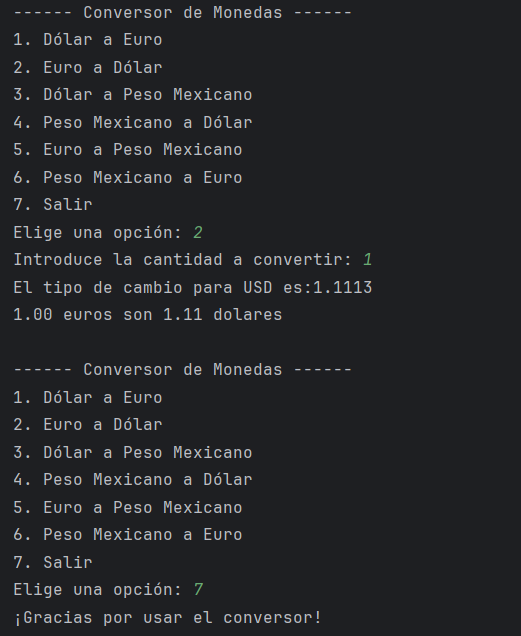

# ConvertidorMonedas
Challenge Convertidor de Monedas Alura

Este challenge brinda la oportunidad de aplicar en la práctica lo aprendido en los cursos. Permitiendo consolidar habilidades y la capacidad para llevar a cabo tareas concretas.

Este proyecto proporciona al usuario una interfaz para consumir una API y evaluar equivalencias entre el peso mexicano, el dolar estadounidense y el euro en tiempo real.

# Requerimientos

1.- GSON: Como herramienta para procesar las respuestas en formato Json al realizar las consultas
2.- Para nuestro actual desafío, hemos elegido la API "Exchange Rate API" por sus tasas de cambio en tiempo real, proporcionando información precisa y actualizada para nuestras conversiones de moneda. Lo mejor de todo, es gratuita y fácil de usar!
# Uso

Al ejecutar Principal, el usuario obtendrá un menú de opciones, con un adecuado manejo de excepciones.

El usuario debe elegir la opción y proporcionar la cantidad a convertir. 

Como respuesta obtiene la equivalencia entre las monedas y la conversión de la cantidad elegida.

# Funcionamiento

## Clase Busqueda
Tiene como elemento de tipo public double la propiedad "valor" .
Con setValor se hacen los request necesarios a la API, para ello se le pasam los atributos mon1 y mon2, o moneda1 y moneda 2.
La consulta que se hace es mon1, y con JsonParser se obtiene el equivalente en mon2.

